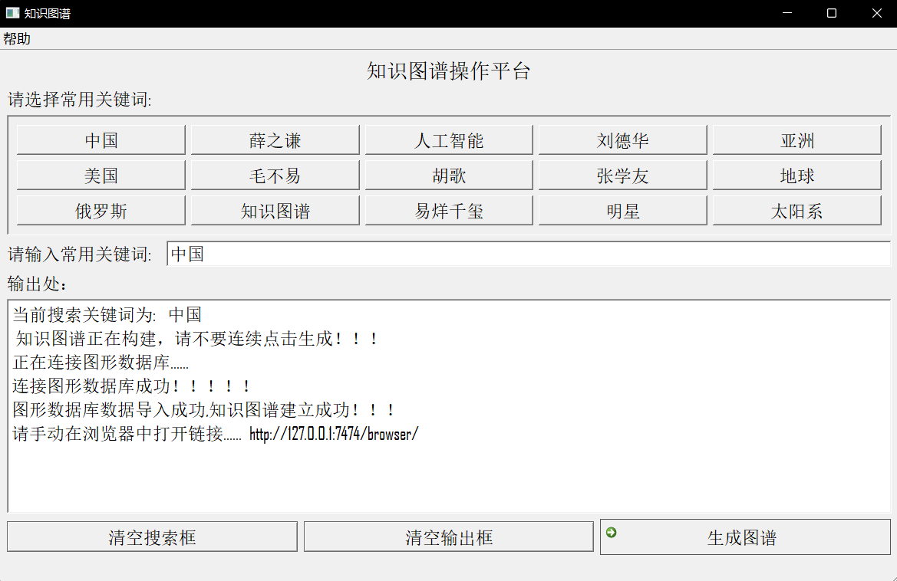
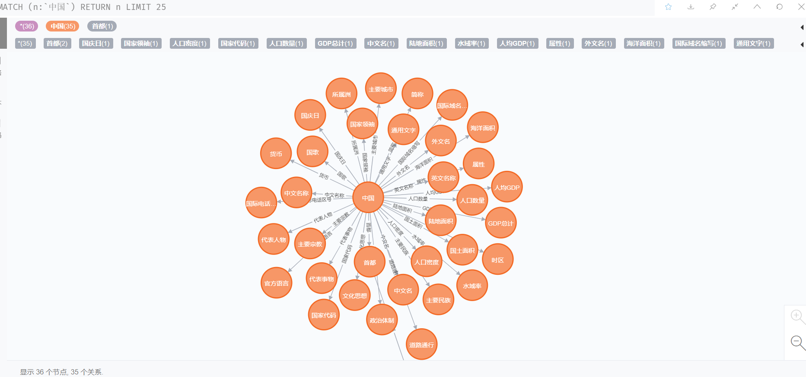

# 项目介绍
    本项目采用通过根据搜索的关键词来爬取与关键词相关的数据，采用的方法为：输入关键词 -> 将爬取的得来的信息进行整合 -> 将信息导入图形数据库 -> 绘制知识图谱

# 项目作者：辞镜、林小盐、洛尘云天

# 模块划分
    一、爬虫获取数据  
    二、可视化操作页面
    三、构建知识图谱
    
# 运行需要用到的编程语言和软件
    一、Python  (3.9.*)
    二、neo4j   (3.5.5 社区版)
    三、java8   (neo4j所需环境)
    四、Pycharm (根据使用者喜好选择)

# 使用方式
    一、安装图形数据库 neo4j(3.5.5 社区版)，然后修改密码 (自行百度)
    二、安装 Java8 (自行百度)
    三、在 source 文件夹里找到 create.py 修改第22行 
        修改图形数据库 的账号密码。
    四、根据 requirements.txt 安装所需模块
    五、运行 main.py -> 在操作页面进行操作 
        -> 打开图形数据库(http://127.0.0.1:7474) 
        -> 点击左上数据库的标识即可显示出该知识图谱

# ###**  运行时所需要的其它模块需要自己根据DEBUG提示安装  **### #

# 总结
１）如何用简洁的方式对关键词所爬取数据并且整合信息是个至关重要的难题。  
２）对可视化操作页面的设计以及API接口的设计是非常挑战全局思维性的。  
３）实体与各节点之间的关系非常考验逻辑思维。

# 部分功能截图

# 有何疑问可以通过邮件形式询问 Email: 1578770127@qq.com
